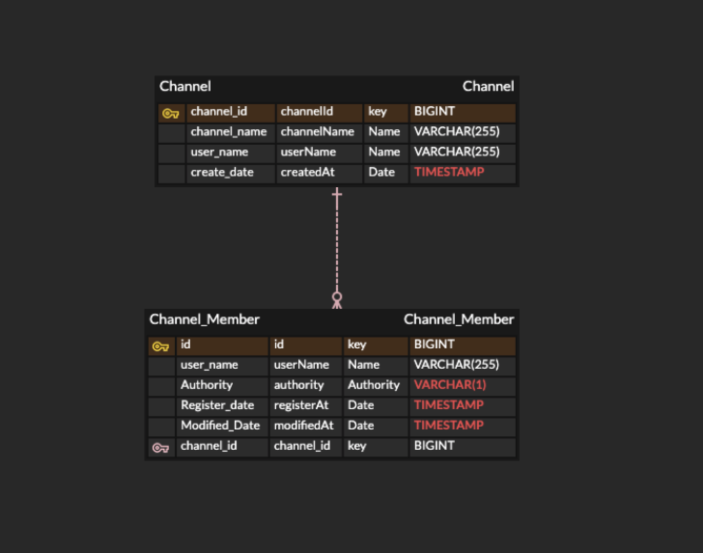

### requirement

@ back-end
* java 8
* spring-boot 2.1.3
* spring-boot-data:redis-reactive, lettuce
* JPA

@ front-end
* front-end client : sock.js
* browser : chrome 64, IE 10


### protocol
* http
* websocket


### library

```groovy
compile('org.springframework.boot:spring-boot-starter-web')
compile('org.springframework.boot:spring-boot-starter-webflux')
compile('org.springframework.boot:spring-boot-starter-websocket')
compile('org.springframework.boot:spring-boot-starter-data-redis-reactive')
compile('io.reactivex.rxjava2:rxjava:2.2.2')
compile('biz.paluch.redis:lettuce:4.4.4.Final')
```

### test library
```groovy
testCompile('org.springframework.boot:spring-boot-starter-test')
testCompile('org.asynchttpclient:async-http-client:2.8.1')
testCompile('org.mockito:mockito-core:2.11.0')
```


### project structure

- study-api : study channel api server 

```
1) 스터디 채팅 채널 추가, 삭제, 변경, 조회 
2) 채팅 채널에 멤버 추가, 삭제, 변경, 조회
 
    - chat room 관련 CRUD 대한 응답 요청은 http rest api 사용
    - 사용자 개인의 채팅방 생성 기준
```
- study-core : study domain api

```
- DDD 기반 설계
- domain layer, infastructure layer만 존재함
- bounded context : 메세지-채널 도메인 분리    

```

- study-messaging : study chatting messaging server

```

- redis 저장, 만료기간은 6개월
- db에는 저장 x
- 채팅 데이터는 JSON 형식으로 저장 
- websocket을 통한 메시지 데이터를 비동기로 처리


- text frame -> 서버에서 json 변경

    - key : v1/chat/user/[topic]
    - values : Json Data

ex)
    {
       "createdAt" : "20190502101125",
       "expired" : "20191102101125",
       "message" : "test1",
       "userName" : "choi",
       "messageID" : "uuid-32",
       "channelID" : 1
    }

``` 


### DB 모델링  



1. study-channel (channelId, channelName, userName, createdAt)
      
2. study-channel-member (id, userName, authority, registerAt, modifiedAt, channelId)

    - channel과 channel-member의 관계는 1:N
    
    
    
### REST API

- URI prefix : /study/api

| Method | URI | Action |  
| :------------ | :-----------: | -------------------: | 
| POST | /channel/create | create channel | 
| PATCH | /channel/{id} | update channel | 
| DELETE | /channel/{id} | delete channel  |
| GET | /channel/{id} | get channel  |
| GET | /channel/{id}/members | get channel member List  |
| POST | /channel/member/add | add channel member  |
| PATCH | /channel/member/{id} | update channel member  |
| DELETE | /channel/member/{id} | delete channel member  |
| GET | /channel/member/{id} | get channel member  |
| GET | /channel/{id}/messages | get channel messages from redis (limited 1000) |

